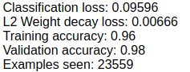

# Assignment 4

#### 2. ConvnetJS MNIST demo
In this lab, we will look at the processing of the MNIST data set using ConvnetJS.  This demo uses this page: http://cs.stanford.edu/people/karpathy/convnetjs/demo/mnist.html
The MNIST data set consists of 28x28 black and white images of hand written digits and the goal is to correctly classify them.  Once you load the page, the network starts running and you can see the loss and predictions change in real time.  Try the following:

* Name all the layers in the network, describe what they do.
```python
layer_defs.push({type:'input', out_sx:24, out_sy:24, out_depth:1});
layer_defs.push({type:'conv', sx:5, filters:8, stride:1, pad:2, activation:'relu'});
layer_defs.push({type:'pool', sx:2, stride:2});
layer_defs.push({type:'conv', sx:5, filters:16, stride:1, pad:2, activation:'relu'});
layer_defs.push({type:'pool', sx:3, stride:3});
layer_defs.push({type:'softmax', num_classes:10});
```

>Input Layer: Holds the pixel values of the image
>Convolutional Layers: Filter the image to build a feature map
>Pooling Layers: Progressively reduces the spacial size to reduce number of parameters to make calculations less expensive
>Softmax Layer: Perform the classification of the image

* Experiment with the number and size of filters in each layer.  Does it improve the accuracy?

>Increasing the number of filters appeared to slow down the model building a lot but did not seem to provide much more accuracy from the default parameters. Smaller filter sizes produced much more accurate results.

* Remove the pooling layers.  Does it impact the accuracy?

>Removing the pooling layers did not appear to have an effect on the accuracy but the computation was a lot slower.

* Add one more conv layer.  Does it help with accuracy?

>The additional layer did not appear to have much of an effect when compared to the default configuration.

* Increase the batch size.  What impact does it have?

> A large batch size (200) required a lot more examples to reach a similar level of accuracy as the default size (20). The validation of the large batch size did also not seem to be as accurate as the default batch size. A batch size of 2 performed about the same as the batch size of 20.

* What is the best accuracy you can achieve? Are you over 99%? 99.5%?

> The best accuracy comes when you let the model run for a long time. After about 25k examples the accuracy was about 97%



#### Keras Notebook

[Notebook](./w251_homework04.ipynb)
