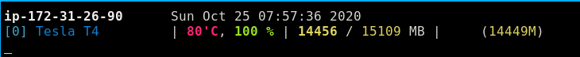
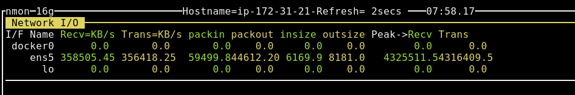
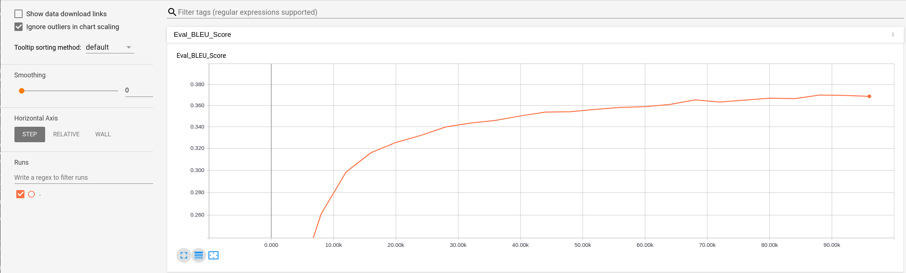
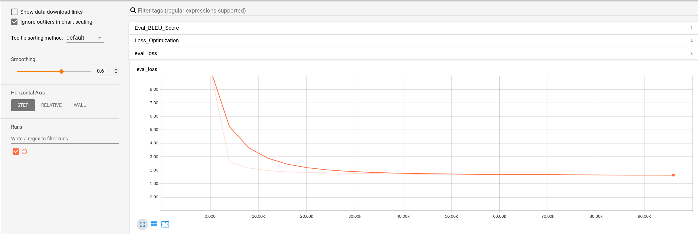
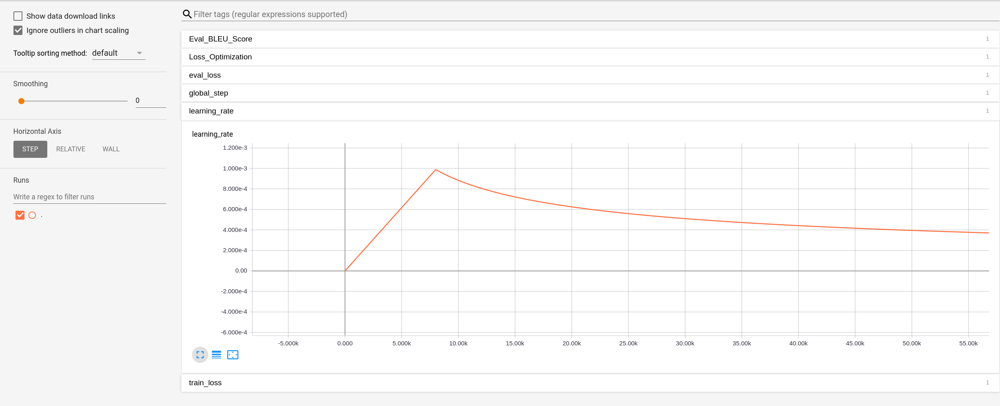

# Homework 9: Distributed Training and Neural Machine Translation


* How long does it take to complete the training run? (hint: this session is on distributed training, so it *will* take a while)

> Spot instances terminated themselves prematurely but training was running for well over 24 hours

* Do you think your model is fully trained? How can you tell?

> The eval loss appears to still be decreasing while the BLEU score is increasing which indicates that the model is not yet fully trained.

* Were you overfitting?

> The model does not appear to be overfitting since the training loss and eval loss were approximately the same.

* Were your GPUs fully utilized?

> Yes




* Did you monitor network traffic (hint:  ```apt install nmon ```) ? Was network the bottleneck?

> Network traffic seemed to have large fluctuations which indicates to me that it is not the bottleneck. Since GPU was pegged at nearly 100% at all times this was the bottleneck.



* Take a look at the plot of the learning rate and then check the config file.  Can you explan this setting?

> The intial learning rate was high due to the 8000 warmup_steps after 8000 steps the learning_rate dropped off.

* How big was your training set (mb)? How many training lines did it contain?

> The training set was about 700MB and contained ~4.5 million lines.

* What are the files that a TF checkpoint is comprised of?

>- **meta file**: Describes the saved graph sructure
>- **index file**: An index of the tensor metadata which maps values in the data file
>- **data file**: The actual values/weights

* How big is your resulting model checkpoint (mb)?

> About 870 MB

* Remember the definition of a "step". How long did an average step take?

> Most steps took around 1.27 seconds but some took over 1.5 seconds

* How does that correlate with the observed network utilization between nodes?

> Network utilization seemed to increase by about 100mbps every second or so. This seems to correlate with the time per step and would indicate higher network traffic after each step to share the global state.

### Screenshots

BLEU TB plot:



Eval Loss:



Learning Rate:


